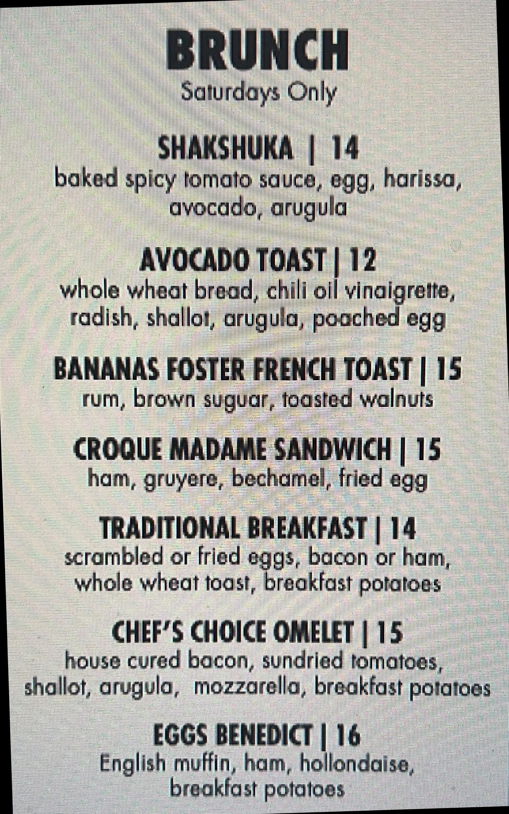

Deskews an image. This is useful to improve text extraction processing.

The algorithm used is described in this [post](https://becominghuman.ai/how-to-automatically-deskew-straighten-a-text-image-using-opencv-a0c30aed83df)

The steps are as follows:

1. Per usual — convert the image to gray scale.
2. Apply slight blurring to decrease noise in the image.
3. Now our goal is to find areas with text, i.e. text blocks of the image. To make text block detection easier we will invert and maximize the colors of our image, that will be achieved via thresholding. So now text becomes white (exactly 255,255,255 white), and background is black (same deal 0,0,0 black).
4. To find text blocks we need to merge all printed characters of the block. We achieve this via dilation (expansion of white pixels). With a larger kernel on X axis to get rid of all spaces between words, and a smaller kernel on Y axis to blend in lines of one block between each other, but keep larger spaces between text blocks intact.
5. Now a simple contour detection with min area rectangle enclosing our contour will form all the text blocks that we need.
6. There can be various approaches to determine skew angle, but we’ll stick to the simple one — take the largest text block and use its angle.

**Original Image**

**Deskewed Image**

